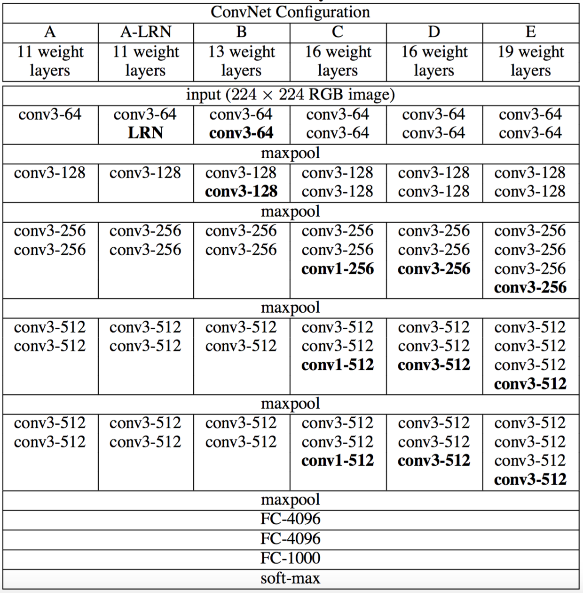

# VGG_Keras_Custom
A practice after reading VGG paper.

### VGG论文学习与keras实现
***
#### 网络结构

​	

* 卷积层命名方式conv[shape]-[layers], shape表示kernel大小，layers表示卷积核个数，如conv3-64表示kernel大小为(3, 3)，数量为64个。padding均为'same'（实际上是1个padding）。
* maxpool的参数是(2, 2), stride=2。
* 网络层层递进，层数分别为16-19层。
* 数据预处理只有一个：将图片减去RBG通道的均值。

#### Discussion
1. **使用小卷积核(3x3, 1x1)代替大卷积核**
对于alexnet开始使用的11x11、7x7的大卷积核，vgg普遍使用了3x3、1x1的小卷积核。
从感受野的层次讨论，3层3x3的卷积得到和1层7x7的卷积相同的感受野，但是3x3有着更多的优势：
    * 更多的卷积层次使得决策功能更加具有辨识度。
    * 同样的，小卷积核具有更少的参数。以3x3和7x7举例：
假设一个3层的3x3的卷积核有C个数的channels，则含有的参数个数为$3(3^2C^2)=27C^2$；对于1层7x7且有C个channels的卷积核，含有的参数个数为$(7C)^2=49C^2$，明显远大于小卷积核的参数个数。

2. **加入1x1的卷积核**
1x1的卷积核并不改变输入的shape，但是会改变channel，可以对channel进行一个调整，增加隐藏层的非线性且不会影响感受野。

#### 参数的初始化
1. **hyperparameters**
* 使用mini_batch GD方式进行训练，batch_size=256
* momentum=0.9
* 增加l2正则化，weight_decay=0.0005
* 在前2个FC层添加Dropout层，dropout=0.5
* 学习率lr=0.01；在验证集的时候，如果accuracy没有明显上升，为lr减少factor=10的参数

2. **networks**
* 首先预训练网络A，参数采取随机初始化，weight服从均值为0、标准差为0.1的高斯分布，biases=0；FC层采用服从均值为0、标准差为0.005的高斯分布
* 更加深层的网络，前4个conv.layer和后3个fc.layer初始化为A网络的参数，其他采用随机初始化
* 可以采用**Glorot&Bengio (2010)** 的方法进行初始化，可以达到和pre-training一样的效果

#### 图像scale (s)的选择
图像的scale的选择具有2种方式：
1. 单尺寸训练：
* 固定s的值，如s=256、s=224等；
* 选取2个s的值，但是每次训练都是固定的，如s1=256，s2=384。应先训练s1，再通过s1的参数训练s2（此时lr应选择为0.001）.

2. 多尺寸训练：
  

  同时训练，但网络需要先用s=384进行预训练。

#### Testing
VGG在test的时候，将最后三层fc层替换成了卷积层，即从fully-connected转变为fully-convolutional。第一层fc变为7x7的卷积层，后2层fc变为1x1的卷积层，layers数要等于分类数，最后取空间平均得到预测结果。

#### 实现
* 使用cifar10数据集
* 只实现了vgg-16
* 只实现了training过程
